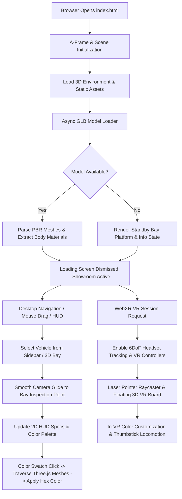
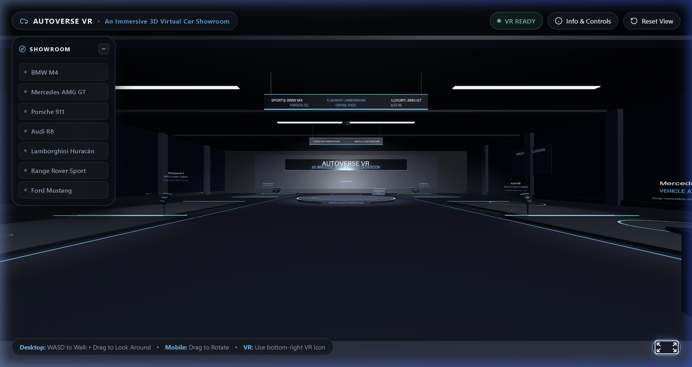
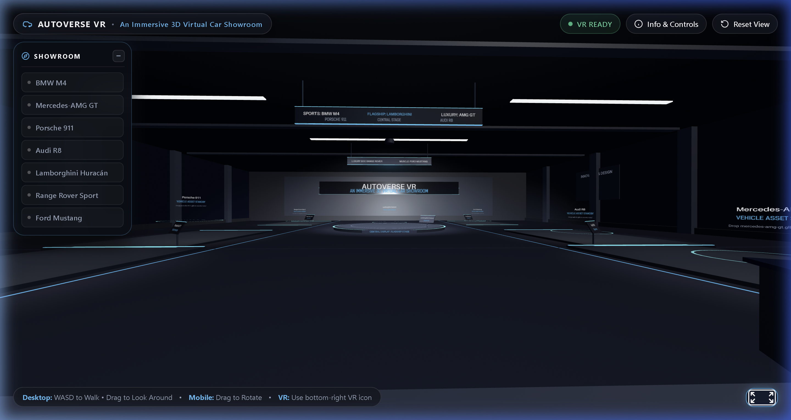
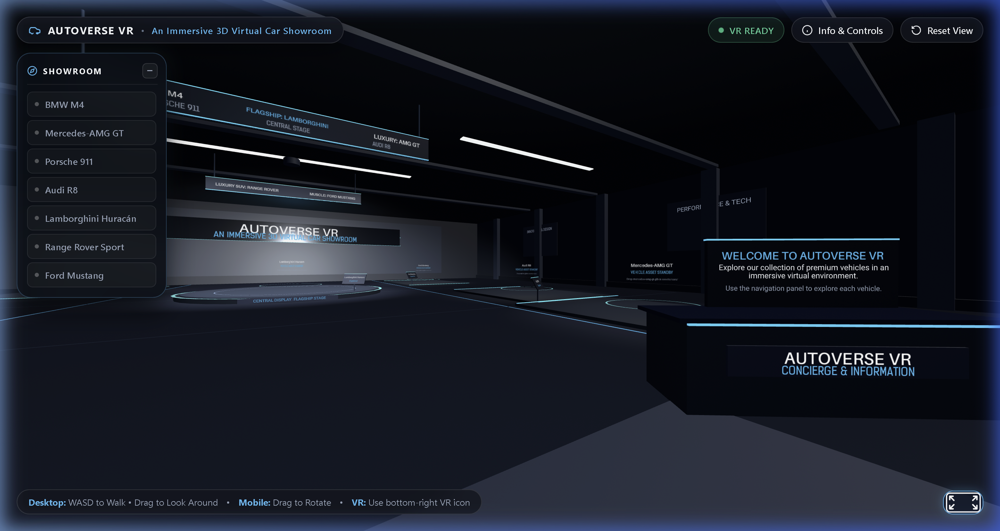

# AutoVerse VR
### An Immersive 3D Virtual Car Showroom

[](https://immersiveweb.dev/)
[](https://aframe.io/)
[](https://threejs.org/)
[](#14-vehicle-asset-attribution-and-licensing)

---

## 1. Project Title & Subtitle

**AutoVerse VR — An Immersive 3D Virtual Car Showroom**  
A high-performance, browser-native 3D and Virtual Reality automotive showroom platform built with modern Web standards, A-Frame, and WebXR.

---

## 2. Project Overview

AutoVerse VR transforms traditional digital car shopping into an interactive, spatial 3D experience accessible directly within any modern web browser without requiring third-party software, plugins, or game engine installations. 

Users can seamlessly navigate an architectural virtual showroom, inspect ultra-detailed sports cars and luxury vehicles on elevated podiums, examine real-time mechanical specifications, dynamically customize vehicle exterior paint colors with physically based rendering (PBR) materials, and transition effortlessly into fully immersive WebXR Virtual Reality on supported VR headsets (such as Meta Quest) or desktop 3D mode.

---

## 3. Problem Statement

Traditional automotive digital retailing relies on static 2D image galleries, pre-rendered 360° photo spinners, or video walkarounds. These legacy formats present critical drawbacks:
- **Lack of True Depth and Spatial Context**: 2D images fail to communicate vehicle proportions, ground clearance, and aerodynamic contours.
- **High Friction and Proprietary Barriers**: Native VR applications built in Unity or Unreal Engine demand heavy multi-gigabyte installations, app store approvals, and specialized gaming hardware.
- **Inflexible Customization**: Pre-rendered visualizers cannot dynamically adapt lighting, textures, or real-time paint reflections across user-selected angles on demand.

**AutoVerse VR** solves this by leveraging browser-native WebGL and the WebXR Device API to deliver instant-load, zero-install 3D spatial exploration across desktop, mobile, and VR headsets.

---

## 4. Project Objectives

- **Zero-Friction Accessibility**: Deliver an immediate, frictionless 3D showroom accessible via a simple URL on any WebGL-compliant browser.
- **Photorealistic Spatial Presentation**: Construct an architectural showroom environment with dynamic lighting, radial floor reflections, and elevated vehicle bays.
- **Interactive Multi-Vehicle Catalog**: Host a 7-vehicle showroom catalog with accurate technical specifications (engine, power, transmission, top speed, acceleration, and price).
- **Real-Time PBR Material Customization**: Implement a dynamic paint customization engine that isolates body paint materials while preserving windows, lights, badges, tires, and interior meshes.
- **Dual-Mode Ergonomics**: Support smooth desktop mouse/keyboard orbit navigation and 6DoF immersive WebXR controller raycasting, locomotion, and floating 3D spatial UI boards.

---

## 5. Key Features

- **Architectural 3D Showroom**: Ambient studio lighting, overhead spotlights, neon boundary accents, central flagship revolving stage, and interactive concierge entrance.
- **7-Vehicle Catalog & Dynamic Podiums**: Configured for 7 high-performance vehicles with individual spatial bays, inspection camera offsets, and technical data sheets.
- **Dual 2D/3D User Interface**:
  - **Desktop HUD**: Floating glassmorphic header, quick vehicle sidebar navigation, real-time specifications panel, orbit inspection controls, and paint swatch palette.
  - **In-World VR Spatial Boards**: Floating curved 3D text panels displaying car specs and interactive 3D color spheres operable via laser-pointer raycaster.
- **Real-Time Paint Customization**: 5 curated high-gloss automotive finishes (Obsidian Black, Pure White, Crimson Red, Royal Blue, Liquid Silver) with material name and pattern filtering.
- **Smooth Camera Gliding & Orbit Controls**: Quadratic and cubic eased camera transitions between entrance and vehicle inspection viewpoints, plus fine-grained 360° vehicle rotation and bounded zoom.
- **Comprehensive Error Handling & Loading Engine**: Progress-tracked initial loading screen, graceful fallback alerts for missing assets, and offline-resilient local/CDN script loading.

---

## 6. Technology Stack

AutoVerse VR is intentionally built strictly on standard, open-web technologies without heavyweight frameworks or server-side runtimes:

- **Markup & Structure**: HTML5 Semantic Elements, A-Frame Custom HTML Tags (`<a-scene>`, `<a-entity>`, `<a-camera>`, `<a-light>`).
- **Styling & Aesthetics**: Vanilla CSS3 (Custom Properties, Glassmorphism `backdrop-filter`, CSS Grid/Flexbox, Keyframe Animations).
- **Client Logic**: Modern JavaScript (ES6+ Modules, DOM APIs, Event Driven Architecture, Animation Frame Request Loops).
- **3D & VR Framework**: [A-Frame v1.6.0](https://aframe.io/) built on [Three.js r124](https://threejs.org/).
- **Immersive API**: [WebXR Device API](https://immersiveweb.dev/) for 6DoF head tracking, controller raycasting, and hand inputs.
- **3D Model Standard**: glTF 2.0 Binary (`.glb`) featuring PBR (Physically Based Rendering) standard material workflows.

---

## 7. How the Application Works



### Core Subsystems:
1. **Scene Graph & Coordinate System**: Centered around `(0, 0, 0)` with the entrance camera positioned at `(0, 0, 16.2)` facing negative Z. Vehicle bays are laid out radially across left, right, and central platforms.
2. **Selective Material Swapping Engine**: When a user selects a color, the engine traverses the vehicle's `THREE.Group` hierarchy, filters out non-body parts (glass, tires, chrome, lights, interior) using negative regex patterns, and updates `material.color.setHex()` on the body paint meshes.
3. **Dual Controller Raycasting**: Left and right WebXR controllers cast laser rays (`a-cursor` / `raycaster`) detecting clickable targets (`.clickable`, `.vr-clickable`) with visual hover states and haptic-ready trigger handlers.

---

## 8. Project Directory Structure

```
AutoVerse/
├── .gitignore                      # Git exclusion rules (OS files, editor files, >100MB GLBs)
├── README.md                       # Comprehensive project master documentation
├── screenshots/                    # Genuine high-resolution application screenshots
│   ├── showroom_overview.png       # Panoramic overview of 3D showroom & UI HUD
│   ├── vehicle_inspection.png      # Close-up inspection mode with specifications panel
│   └── showroom_walkthrough.png    # Interactive spatial view of showroom bays
├── docs/                           # Academic & technical documentation package
│   ├── PROJECT_REPORT.md           # Formal undergraduate CSE project report
│   ├── USER_GUIDE.md               # End-user navigation and operation manual
│   ├── VIVA_QUESTIONS.md           # 20+ viva examination questions with detailed answers
│   └── FINAL_SUBMISSION_CHECKLIST.md # Complete verification and audit checklist
└── 3d-car-showroom/                # Web application root
    ├── index.html                  # Main A-Frame scene, HUD overlay, and 3D entities
    ├── style.css                   # Glassmorphic UI styles, animations, and HUD layouts
    ├── script.js                   # Master application controller, specifications, customizer
    └── assets/                     # 3D assets, libraries, and attribution files
        ├── README.md               # Asset directory guidelines and setup instructions
        ├── aframe.min.js           # Local offline A-Frame library (v1.6.0)
        └── cars/                   # Binary glTF 3D vehicle models
            ├── ATTRIBUTION.md      # Creator credits, source URLs, and CC licensing
            ├── bmw-m4.glb          # BMW M4 Competition 3D model (22.7 MB)
            ├── porsche-911.glb     # Porsche 911 Carrera 4S 3D model (4.05 MB)
            └── audi-r8.glb         # Audi R8 Coupe 3D model (110.6 MB, excluded from git)
```

---

## 9. Installation and Local Setup

AutoVerse VR is a pure client-side web application. **No build step, compiler, backend database, or `npm install` is required.**

### Prerequisites
- Any modern Web browser supporting WebGL and WebXR (Google Chrome, Microsoft Edge, Brave, Mozilla Firefox, or Meta Quest Browser).
- A basic local static HTTP server (required because browsers restrict loading 3D `.glb` assets and textures over the raw `file://` protocol due to CORS security policies).

### Option A: Using Python (Recommended & Easiest)
1. Clone or download the repository:
   ```bash
   git clone https://github.com/Vidheendu/AutoVerse.git
   cd AutoVerse/3d-car-showroom
   ```
2. Start a lightweight HTTP server:
   ```bash
   # Python 3
   python -m http.server 8080
   ```
3. Open `http://localhost:8080` in your web browser.

### Option B: Using VS Code Live Server Extension
1. Open the `AutoVerse` workspace in Visual Studio Code.
2. Right-click `3d-car-showroom/index.html`.
3. Select **"Open with Live Server"**.

### Option C: Using Node `npx serve` or `http-server`
```bash
cd AutoVerse/3d-car-showroom
npx serve -l 8080
```

---

## 10. How to Run the Project

1. Start your local HTTP server as described above.
2. Navigate to `http://localhost:8080` in your browser.
3. Allow the loading screen to finish initializing A-Frame and 3D vehicle assets.
4. Use the navigation sidebar or click any car platform to begin inspecting vehicles!

---

## 11. Desktop Controls

| Action | Input / Control | Description |
|---|---|---|
| **Look / Pan Around** | `Mouse Left-Click + Drag` | Rotates the 3D viewpoint in 360 degrees. |
| **Walk Through Showroom** | `W`, `A`, `S`, `D` or `Arrow Keys` | Moves the camera rig smoothly through the showroom floor. |
| **Select Vehicle** | `Click Navigation Item` or `Click 3D Car` | Smoothly glides camera to bay and opens specifications panel. |
| **Rotate Selected Car** | `◀ Rotate Left` / `Rotate Right ▶` | Rotates the vehicle around its vertical axis on the podium. |
| **Zoom In / Out** | `+ Zoom In` / `- Zoom Out` or `Mouse Wheel` | Bounds camera inspection distance between safe minimum and maximum radii. |
| **Reset Vehicle View** | `Reset View` Button | Restores default camera angle and distance for the active car. |
| **Customize Color** | Click Color Swatches (`Red`, `Blue`, `White`, `Black`, `Silver`) | Instantly updates body paint material in real time. |
| **Reset to Entrance** | `Reset View` (Top HUD) | Returns camera to the showroom entrance concierge desk. |

---

## 12. VR Controls (WebXR Headset)

| Action | Controller Input | Description |
|---|---|---|
| **Head Tracking** | 6DoF Head Movement | Full natural head rotation and positional movement in physical space. |
| **Select / Interact** | `Index Trigger` | Points laser raycaster at 3D cars, platform buttons, or color spheres to trigger actions. |
| **Teleport / Locomotion** | `Thumbstick Forward / Click` | Teleports or walks to highlighted floor target spots. |
| **Snap Turning** | `Thumbstick Left / Right` | Rotates VR viewpoint in comfortable 45° increments to minimize motion sickness. |
| **In-World VR Info Board** | Look at floating 3D board | Displays real-time vehicle specs and 3D interactive color selector spheres beside each bay. |
| **Exit VR Mode** | Headset Universal Menu or VR Exit icon | Exits immersive WebXR session back to standard browser view. |

---

## 13. Browser and WebXR Requirements

- **Localhost / Secure Context (HTTPS)**: The WebXR Device API requires a secure context (`localhost`, `127.0.0.1`, or an `https://` domain).
- **Supported Desktop Browsers**: Google Chrome (v79+), Microsoft Edge (v79+), Brave, Firefox, Opera.
- **Supported VR Headsets & Browsers**:
  - **Meta Quest 2 / 3 / Pro**: Meta Quest Browser (recommended).
  - **PC VR (HTC Vive, Valve Index, Oculus Rift)**: Chrome/Edge with SteamVR or Oculus runtime.
  - **Apple Vision Pro**: Safari with WebXR features enabled.
- **Mobile Browsers**: Chrome for Android, Safari on iOS (supports 3D touch orbit and gyroscope look).

---

## 14. Vehicle Asset Attribution and Licensing

AutoVerse VR respects open-source and Creative Commons licensing. All 3D models are attributed to their respective creators below (preserved from `assets/cars/ATTRIBUTION.md`):

| Vehicle | Model Name | Source / Creator | License | Status | File Size |
|---|---|---|---|---|---|
| **BMW M4** | BMW M4 Competition M Package | [SRT Performance™](https://sketchfab.com/TheRealSRT) via [Sketchfab](https://sketchfab.com/3d-models/bmw-m4-competition-m-package-5c0a2dafb1ad408d9fc9eeef9aee531b) | CC BY 4.0 | ✅ Active & Calibrated | ~22.7 MB |
| **Porsche 911** | Porsche 911 Carrera 4S | [PlayCanvas Web Components](https://github.com/playcanvas/web-components) | Open Source / CC | ✅ Active & Calibrated | ~4.05 MB |
| **Audi R8** | Audi R8 Coupe | [Mayawaaan/AudiR8](https://github.com/Mayawaaan/AudiR8) | CC Attribution | ✅ Calibrated & Configured | ~110.6 MB *(git ignored)* |
| **Mercedes-AMG GT** | Mercedes-AMG GT | Architecture & Podium Ready | — | 📥 Ready for user `.glb` | — |
| **Lamborghini Huracán** | Lamborghini Huracán | Architecture & Flagship Ready | — | 📥 Ready for user `.glb` | — |
| **Range Rover Sport** | Range Rover Sport | Architecture & Podium Ready | — | 📥 Ready for user `.glb` | — |
| **Ford Mustang** | Ford Mustang | Architecture & Podium Ready | — | 📥 Ready for user `.glb` | — |

*Note: `audi-r8.glb` exceeds GitHub's 100 MB single file limit and is excluded from the Git commit history via `.gitignore`. To add it locally, place `audi-r8.glb` in `3d-car-showroom/assets/cars/` as documented in `assets/README.md`.*

---

## 15. Known Limitations

1. **GitHub File Size Constraint**: Due to GitHub's strict 100 MB individual file limit, the 110.6 MB `audi-r8.glb` asset is excluded from Git tracking. The application loads smoothly and provides full support for the model when placed locally.
2. **GPU Memory Footprint on Mobile**: Rendering multiple high-polygon PBR vehicles simultaneously can require significant WebGL VRAM. On low-end mobile hardware, frame rates may drop below 60 FPS.
3. **Browser Security Restrictions for VR**: WebXR sessions cannot launch from insecure HTTP endpoints outside of `localhost` / `127.0.0.1`.
4. **Active 3D Models Count**: 3 vehicles (BMW M4, Porsche 911, Audi R8) are fully calibrated and bundled/configured with 3D GLB assets; the remaining 4 vehicles feature complete podium architectures, coordinate definitions, specs data, and graceful standby indicators awaiting custom GLB uploads.

---

## 16. Future Scope

- **WebRTC Multiplayer Showroom**: Synchronized multi-user spatial audio and collaborative car inspection with avatars.
- **WebGPU Ray-Traced Reflections**: Next-generation real-time dynamic studio reflections and realistic clearcoat car paint shaders.
- **Interactive 360° Interior Cockpit View**: Step-inside camera transitions allowing users to interact with dashboards, steering wheels, and infotainment screens.
- **Dynamic Environment & Lighting Modes**: Switchable showroom themes (e.g., Midnight Neon, Daylight Studio, Cyberpunk Sunset, Underground Garage).
- **Interactive Audio Engine**: Spatial engine revving, exhaust acoustic notes, and door-shut sound effects mapped to 3D positional audio nodes.

---

## 17. Academic Project Disclaimer

This project, **AutoVerse VR — An Immersive 3D Virtual Car Showroom**, was developed as an academic Computer Science & Engineering capstone project. All brand names, trademarks, logos, and vehicle designs (BMW, Mercedes-Benz, Porsche, Audi, Lamborghini, Land Rover, Ford) belong to their respective copyright and trademark owners. 3D models are utilized solely for non-commercial, educational, and research purposes under Creative Commons licensing.

---

## 📸 Screenshots

| Showroom Overview | Vehicle Inspection & Specifications |
|:---:|:---:|
|  |  |

| Showroom Spatial Walkthrough |
|:---:|
|  |

---

**Developed with ❤️ for Advanced WebXR & 3D Web Graphics.**
