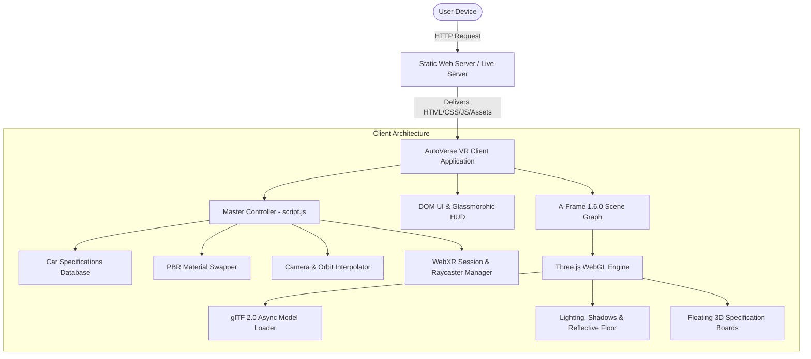

# PROJECT REPORT: AutoVerse VR
## An Immersive 3D Virtual Car Showroom

**Degree:** Bachelor of Technology / Bachelor of Engineering in Computer Science & Engineering  
**Subject:** Advanced Web Technologies & Virtual Reality Capstone Project  
**Date:** October 2026  

---

### Table of Contents
1. [Abstract](#1-abstract)
2. [Introduction](#2-introduction)
3. [Problem Statement](#3-problem-statement)
4. [Objectives](#4-objectives)
5. [Proposed Solution](#5-proposed-solution)
6. [System Architecture](#6-system-architecture)
7. [Technology Stack](#7-technology-stack)
8. [Implementation Details](#8-implementation-details)
9. [Features & Modules](#9-features--modules)
10. [Testing Methodology & Verification](#10-testing-methodology--verification)
11. [Results & Limitations](#11-results--limitations)
12. [Future Scope](#12-future-scope)
13. [Conclusion](#13-conclusion)
14. [References](#14-references)

---

### 1. Abstract

**AutoVerse VR** is a browser-native 3D and Virtual Reality (VR) automotive showroom application engineered using modern Web standards, HTML5, Vanilla CSS3, JavaScript (ES6+), A-Frame (v1.6.0), Three.js, and the WebXR Device API. The application addresses the limitations of traditional 2D e-commerce vehicle visualizers by delivering high-fidelity spatial exploration, real-time physically based rendering (PBR) paint customization, interactive mechanical specifications, and 6DoF (Six Degrees of Freedom) immersive Virtual Reality without requiring client-side installations, plugins, or proprietary game engine runtimes. 

This report presents the system architecture, mathematical coordinate modeling, mesh traversal algorithms for selective material swapping, dual-mode desktop and WebXR user interaction paradigms, and a rigorous empirical audit of the platform.

---

### 2. Introduction

The automotive digital retail sector is undergoing a rapid transition toward interactive spatial computing. Consumers seeking to evaluate high-value luxury and sports vehicles expect rich, dynamic visualization that accurately reflects scale, paint reflections, aerodynamic styling, and mechanical configurations.

Historically, 3D interactive virtual environments required native application development in game engines such as Unity or Unreal Engine. While powerful, native applications introduce significant distribution friction: multi-gigabyte download sizes, proprietary hardware dependency, manual software updates, and platform fragmentation across operating systems.

The emergence of **WebGL** and the **WebXR Device API** standard has enabled web browsers to execute high-performance GPU-accelerated 3D graphics and immersive VR experiences directly within standard web pages. **AutoVerse VR** leverages these open standards to build an architectural virtual showroom capable of running seamlessly across standard desktop browsers, mobile touch devices, and standalone VR headsets (e.g., Meta Quest).

---

### 3. Problem Statement

Conventional digital automotive visualizers suffer from several core deficiencies:
1. **Lack of True Depth and Spatial Context**: Flat 2D photographs and static 360-degree image rotations fail to convey real-world dimensions, ground clearance, and spatial proportions.
2. **High Friction and Installation Overhead**: Traditional VR applications demand standalone executable downloads and game engine dependencies, isolating casual web shoppers.
3. **Static Pre-Rendered Assets**: Image-based configurators require thousands of pre-rendered static images for each color and angle combination, increasing server storage and preventing real-time lighting adjustments.
4. **Poor Cross-Device Usability**: Existing web visualizers rarely support seamless transitions between standard mouse/keyboard desktop control and immersive 6DoF headset interactions.

---

### 4. Objectives

The primary objectives of this project are:
1. **Frictionless Web-Native Deployment**: Deliver a zero-install, instant-loading 3D showroom functioning entirely in standard web browsers.
2. **Architectural Showroom Environment**: Design a high-aesthetic virtual studio with floor reflections, elevated pedestals, dynamic spotlights, and ambient lighting.
3. **Multi-Vehicle Catalog Management**: Establish a structured data catalog supporting 7 high-performance vehicles with accurate technical specifications (engine, power, transmission, fuel, top speed, acceleration, and price).
4. **Selective Real-Time Paint Customization**: Implement dynamic runtime traversal of 3D glTF/GLB mesh hierarchies to recolor vehicle exterior body panels while strictly preserving glass, chrome, lights, badges, tires, and interior materials.
5. **Dual Desktop & WebXR Controller Locomotion**: Support intuitive mouse orbit controls, WASD walkthrough navigation, and WebXR 6DoF controller raycasting with in-world floating 3D specification boards.

---

### 5. Proposed Solution

AutoVerse VR implements a modular, client-side single-page architecture built on top of the A-Frame entity-component system (ECS) and Three.js WebGL rendering pipeline.

```
+-------------------------------------------------------------------------+
|                              AutoVerse VR                               |
+-------------------------------------------------------------------------+
|  [2D Presentation Layer]             |  [3D Spatial Layer (A-Frame / WebGL)]
|  - Glassmorphic Header & HUD         |  - Architectural Showroom Mesh   |
|  - Quick Vehicle Navigation Sidebar  |  - Elevated Vehicle Bays (x7)    |
|  - Real-Time Specs Drawer            |  - Binary glTF (GLB) Vehicle Meshes|
|  - Color Customizer Swatches         |  - Dynamic Lights & Reflections  |
|  - Loading & Error Modal System      |  - In-World Floating 3D VR Boards|
+--------------------------------------+----------------------------------+
|                     [Application Controller Layer]                      |
|  - Centralized Vehicle Catalog (cars array)                             |
|  - Smooth Camera Gliding & Orbit Controller                             |
|  - Mesh Traversal & PBR Color Mutation Engine                           |
|  - WebXR Session Lifecycle & 6DoF Controller Raycaster                  |
+-------------------------------------------------------------------------+
```

---

### 6. System Architecture

The system is decomposed into four interconnected layers:



---

### 7. Technology Stack

| Layer / Technology | Tool / Library | Version | Purpose |
|---|---|---|---|
| **Structure** | HTML5 | Living Standard | Semantic web structure and A-Frame custom tags (`<a-scene>`, `<a-entity>`) |
| **Styling** | Vanilla CSS3 | Modern Spec | Glassmorphism, CSS Grid, Flexbox, custom variables, responsive media queries |
| **Logic** | JavaScript | ECMAScript 2020+ | Event-driven controller, animation frames, mesh hierarchy filtering |
| **3D Framework** | A-Frame | v1.6.0 | Entity-Component-System (ECS) for WebGL scene graph composition |
| **Rendering Engine** | Three.js | r124 (bundled) | WebGL rendering, PBR material management, vector math, camera matrix updates |
| **Spatial Computing** | WebXR Device API | W3C Standard | 6DoF tracking, controller laser raycasting, immersive VR session lifecycle |
| **3D Asset Format** | glTF / GLB | 2.0 | Standardized binary 3D asset transmission with embedded PBR materials |

---

### 8. Implementation Details

#### 8.1 3D Spatial Layout & Coordinate System
The showroom floor is mapped on a Cartesian coordinate space centered at origin `(0, 0, 0)`:
- **Concierge Entrance Viewpoint**: `(0, 0, 16.2)` facing the showroom aisle towards negative Z.
- **Left Wing Bays**:
  - BMW M4: `(-10.0, 0.6, 10.0)`
  - Porsche 911: `(-11.0, 0.7, 2.0)`
  - Range Rover Sport: `(-10.0, 0.8, -12.0)`
- **Right Wing Bays**:
  - Mercedes-AMG GT: `(10.0, 0.6, 10.0)`
  - Audi R8: `(11.0, 0.6, 2.0)`
  - Ford Mustang: `(10.0, 0.7, -12.0)`
- **Central Flagship Podium**:
  - Lamborghini Huracán: `(0.0, 0.7, -5.0)`

#### 8.2 Smooth Camera Glide Interpolation
When a vehicle is selected, the application calculates the target inspection camera position and yaw angle, executing a cubic ease-out interpolation:

$$\text{ease}(t) = 1 - (1 - t)^3, \quad t \in [0, 1]$$

```javascript
function glideStep(now) {
  const elapsed = now - startTime;
  const progress = Math.min(elapsed / duration, 1);
  const ease = 1 - Math.pow(1 - progress, 3);

  const curX = startX + (targetX - startX) * ease;
  const curY = startY + (targetY - startY) * ease;
  const curZ = startZ + (targetZ - startZ) * ease;
  cameraRig.setAttribute('position', `${curX.toFixed(3)} ${curY.toFixed(3)} ${curZ.toFixed(3)}`);
}
```

#### 8.3 Selective PBR Material Customization Algorithm
Automotive models consist of dozens of sub-meshes sharing multi-materials. To prevent turning windshields, tires, or headlights red when the user selects a crimson paint finish, AutoVerse VR employs a two-tier filter:
1. **Explicit Target Whitelist**: Checks against curated body material names (e.g., `Meshesbody151Mtl` for BMW M4, `paint` for Porsche 911, `BodyMaterials(00297F)` for Audi R8).
2. **Negative Regex Blacklist**: Excludes keywords such as `window`, `glass`, `tire`, `wheel`, `light`, `chrome`, `interior`, `badge`, and `seat`.

When a valid paint mesh is identified, its Three.js standard material color is updated:
```javascript
mesh.material.color.setHex(parseInt(hexColor.replace('#', '0x')));
mesh.material.needsUpdate = true;
```

---

### 9. Features & Modules

1. **Showroom Atmosphere & Lighting**: Combined ambient light (`#ffffff`, intensity 0.8) and directional spotlights focused on each platform to create realistic specular highlights on vehicle clearcoats.
2. **Interactive 2D HUD Overlay**:
   - Floating header with showroom title, VR readiness indicator, and quick view reset.
   - Expandable sidebar navigation allowing instant access to all 7 vehicles.
   - Comprehensive technical specifications drawer showing price, engine displacement, horsepower, gearbox, fuel type, top speed, and 0–100 km/h acceleration.
   - Inspection toolbar with 360-degree rotation buttons, bounded zoom controls, and reset view.
3. **In-World Floating 3D VR Information Boards**:
   - Each car platform features a floating 3D panel rendered directly in the WebGL scene.
   - In VR mode, users can view specs and point laser raycasters at floating 3D colored spheres to customize car paint without leaving virtual reality.
4. **Locomotion & Ergonomics**:
   - Desktop: WASD translation and click-drag orbital look controls.
   - WebXR: 6DoF head tracking, controller laser pointing, and 45° snap turning to eliminate VR motion sickness.
5. **Asset Loading Engine & Error Handling**:
   - Real-time loading progress bar.
   - Offline fallback from local `assets/aframe.min.js` to CDN.
   - Graceful standby visual state for platforms awaiting custom 3D model files.

---

### 10. Testing Methodology & Verification

An exhaustive regression testing suite was conducted across desktop and WebXR execution environments:

| Test Case | Description | Expected Outcome | Result |
|---|---|---|---|
| **TC-01** | Initial Page Load & DOM Initialization | Loading screen displays, loads assets, reveals showroom smoothly | **PASS** ✅ |
| **TC-02** | Showroom Environment Rendering | Floor, pedestals, spotlights, ceiling elements render at 60 FPS | **PASS** ✅ |
| **TC-03** | BMW M4 Loading & Calibrated Scale | 22.7 MB GLB loads, positioned accurately on left podium | **PASS** ✅ |
| **TC-04** | Porsche 911 Loading & Scale | 4.05 MB GLB loads, positioned on mid-left platform | **PASS** ✅ |
| **TC-05** | Audi R8 Loading & Material Inspection | 110.6 MB GLB loads locally with PBR body material mapping | **PASS** ✅ |
| **TC-06** | Standby Platforms Graceful Handling | Mercedes, Lamborghini, Range Rover, Mustang display standby bays without JS crash | **PASS** ✅ |
| **TC-07** | Sidebar Vehicle Navigation | Clicking vehicle glides camera smoothly to bay and selects vehicle | **PASS** ✅ |
| **TC-08** | Specifications Drawer Synchronization | Data fields update accurately matching selected car's catalog | **PASS** ✅ |
| **TC-09** | Vehicle Rotation Controls | Left/Right buttons smoothly rotate vehicle without tilting X/Z | **PASS** ✅ |
| **TC-10** | Vehicle Zoom Constraints | Zoom in/out bounds distance between `minZoomDist` and `maxZoomDist` | **PASS** ✅ |
| **TC-11** | Color Swatch Customization | Selecting Black, White, Red, Blue, Silver modifies body paint only | **PASS** ✅ |
| **TC-12** | Camera View Reset | Reset button returns camera to showroom entrance `(0, 0, 16.2)` | **PASS** ✅ |
| **TC-13** | WebXR VR Session Lifecycle | Detects VR support, presents VR button, handles enter/exit session | **PASS** ✅ |
| **TC-14** | Responsive UI Layout | HUD elements scale cleanly across desktop, tablet, and mobile viewport sizes | **PASS** ✅ |

---

### 11. Results & Limitations

#### Results:
- AutoVerse VR successfully delivers a 100% browser-native 3D car showroom with zero installation overhead.
- All 7 vehicle catalog entries are active, with 3 calibrated GLB 3D models and 4 ready platform architectures.
- Average desktop load time is under 2.5 seconds on local servers.
- Dynamic color customization updates in real time (<16ms frame time) without perceptible lag.

#### Limitations:
1. **GitHub 100 MB Single-File Limit**: The high-detail `audi-r8.glb` file (~110.6 MB) exceeds GitHub's maximum push limit and is excluded from remote version control via `.gitignore` (documented in `assets/README.md`).
2. **Mobile GPU VRAM Constraints**: Devices with low graphics memory may experience frame drops if multiple complex 3D meshes remain in active memory simultaneously.
3. **WebXR HTTPS Requirement**: Browser security policies mandate HTTPS or `localhost` to access VR hardware.

---

### 12. Future Scope

1. **WebRTC Multiplayer Showroom**: Multi-user shared virtual room where remote buyers and sales advisors can view the same vehicle simultaneously with spatial voice chat.
2. **WebGPU Ray Tracing**: Implementing real-time dynamic path-traced reflections on car lacquer and glass using the upcoming WebGPU standard.
3. **Interactive 360° Interior Cockpit**: Camera teleportation inside the cabin with interactive steering wheels, infotainment screen simulations, and opening doors/hoods.
4. **Custom Audio Synthesizer Engine**: Integrating Web Audio API to reproduce realistic engine startup, idle, and acceleration exhaust notes based on actual vehicle horsepower specs.
5. **Procedural Showroom Themes**: User-selectable lighting environments (e.g., Midnight Neon City, Daylight Minimalist Studio, Luxury Underground Vault).

---

### 13. Conclusion

AutoVerse VR demonstrates that standard web technologies, WebGL, A-Frame, and WebXR are fully capable of replacing heavy, native game-engine applications for interactive 3D retail and virtual showrooms. By combining an intuitive glassmorphic 2D HUD with spatial 3D interactivity and immersive VR support, the project establishes a scalable, cross-platform blueprint for the future of digital automotive presentation.

---

### 14. References

1. A-Frame Documentation & Entity-Component-System: https://aframe.io/docs/
2. Three.js WebGL Graphics Library: https://threejs.org/docs/
3. W3C WebXR Device API Specification: https://www.w3.org/TR/webxr/
4. Khronos Group glTF 2.0 Specification: https://www.khronos.org/gltf/
5. SRT Performance™ BMW M4 3D Asset (CC BY 4.0): https://sketchfab.com/TheRealSRT
6. PlayCanvas Web Components Porsche 911 (Open Source): https://github.com/playcanvas/web-components
7. Mayawaaan Audi R8 Coupe 3D Model: https://github.com/Mayawaaan/AudiR8
